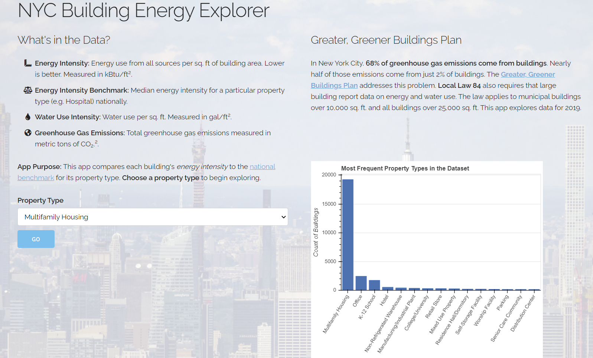
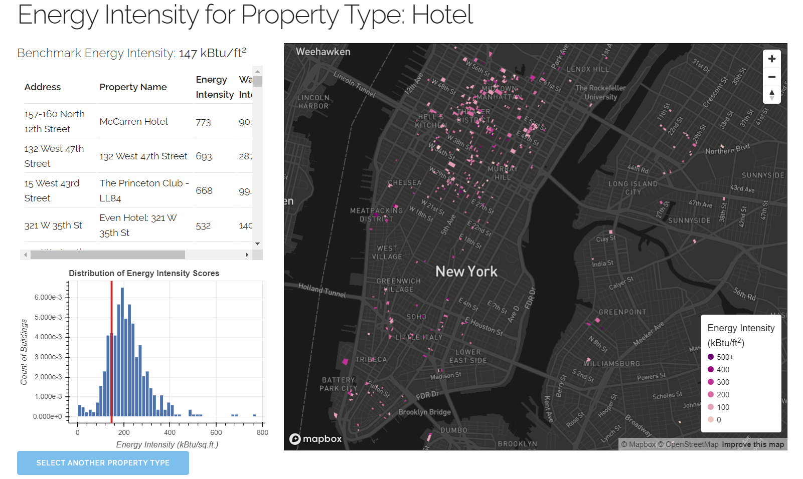
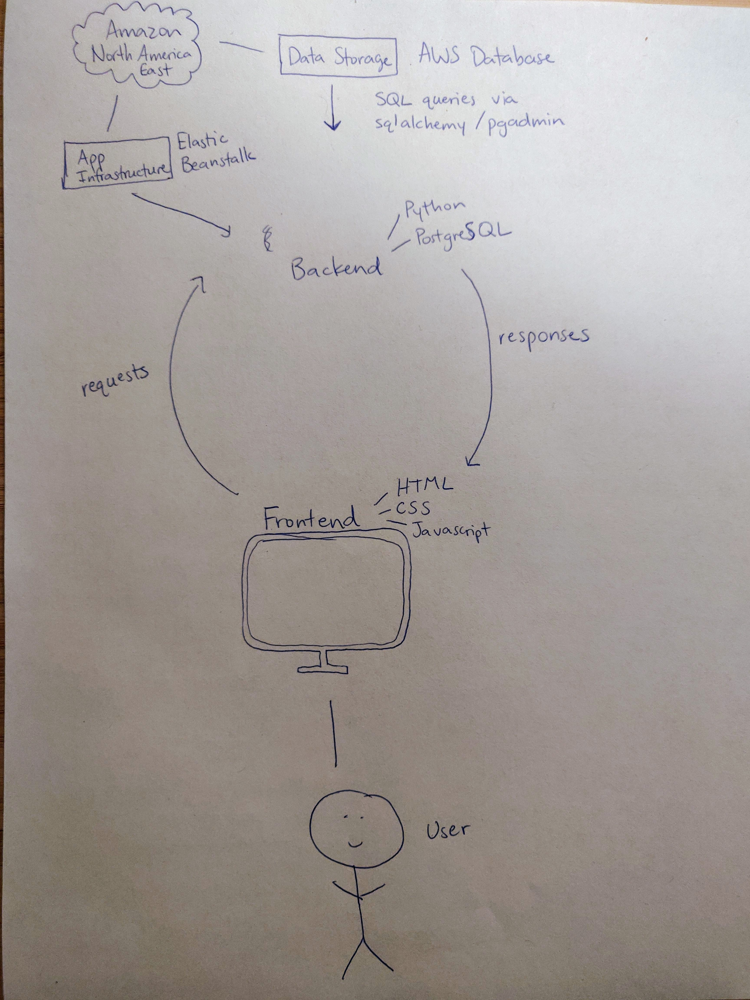

# New York Building Energy Explorer
## Kate Sutton | MUSA 509: Geospatial Cloud Computing 

### Overview
This project explores the [building energy and water use dataset](https://data.cityofnewyork.us/Environment/Energy-and-Water-Data-Disclosure-for-Local-Law-84-/qb3v-bbre) for New York City. This dataset originates from New York City Local Law 84, passed in 2009 which requires that large buildings report data on energy and water usage to the city annually. When first enacted, it applied to all buildings over 50,000 sq. ft. and municipal buildings over 10,000 sq. ft. Starting in 2017, reporting was also required for buildings over 25,000 sq. ft. This project analyzes reporting for 2019. Some interesting fields include: 

* Identifying Fields
  * Property Name (e.g. Conde Nast Building)
  * Address
  * BBL: 10-digit number indicating the Borough, Block, and Lot of the parcel
  * BIN: NYC Building Identification Number
* Building Information
  * Gross Floor Area
  * Primary Property Type (e.g. Office or Retail Store)
  * Year Built
  * Number of Buildings
  * Occupancy
* Energy Fields
  * Energy Star Score
  * Site EUI: Site energy use intensity, measured in kBtus per gross square foot (kBtu/ft2)
  * Source EUI: Source energy use intensity, measured in kBtus per gross square foot (kBtu/ft2)
  * Electricity, Natural Gas, and District Steam Use
  * Total, Direct, and Indirect GHG Emissions
* Water Information
  * Water Use 
  * Water Use Intensity

The dataset is available on New York City Open Data and is hosted in a database on Amazon Web Services Relational Database System. It has 28,800 records. The app is also deployed on Amazon Web Services using Elastic Beanstalk. Due to student account limits, the app will only be live until January 15, 2021. 

### Site vs. Source EUI
EUI, or energy use intensity, provides a measure of energy use that is normalized for building size (in this case gross square footage). The EPA has designated [two types](https://www.energystar.gov/buildings/facility-owners-and-managers/existing-buildings/use-portfolio-manager/understand-metrics/difference) of energy use intensity measures: site and source. This distinction draws on the difference between primary and secondary energy. *Primary energy* is raw fuel that is burned on-site to generate energy, such as natural gas or fuel oil. *Secondary energy* is generated at off-site sources, such as the electricity purchased from the grid or heat from a district steam system. **Site EUI** draws only on primary energy use while **Source EUI** includes both primary and secondary energy use. 

Since grid electricity is such an important element of energy use, this project will analyze Source EUI only, referred to in the project as <i>energy intensity</i> for simplicity. ConEdison also operates the [largest district steam system](https://www.coned.com/-/media/files/coned/documents/for-commercial-industries/steam/building-on-steam-brochure.pdf) in the U.S., serving Manhattan south of 96th St., which contributes to secondary energy use. 

### Benchmarking
Energy Intensity is benchmarked according to the property type because different uses have varying energy use patterns. For example, hospitals and restaurants tend to have much higher energy intensity than schools or residential buildings. Energy Star maintains a [dataset](https://portfoliomanager.energystar.gov/pdf/reference/US%20National%20Median%20Table.pdf) of benchmark energy use intensity for each property type. This benchmark is calculated as the median of all energy intensity values for a particular property type nationally. I transcribed this dataset from a pdf into a csv and uploaded it to my AWS RDS. 

### Data Cleaning
I chose to visualize buildings using parcel polygons. The dataset to which I could most easily join the parcels was [MapPLUTO](https://www1.nyc.gov/site/planning/data-maps/open-data/dwn-pluto-mappluto.page), which hosts information about buildings and land use throughout NYC. Since MapPLUTO is such a large file, I did not want to upload the whole file to my RDS. I joined it to the energy data using the BBL field. The BBL field in the energy data needed to be cleaned. Multiple records were stored within one cell, separated with semicolons, commas, etc. I split these into multiple records using python. I removed records for which the SourceEUI field was null. I also removed some outliers with an energy intensity above 1,000,000 (almost all properties were less than 1000) because they made for unintelligible distribution plots.

### App Purpose
The app helps the user explore how well New York City's buildings compare against the national benchmark. Users can: 
* filter the data according to property type
* find individual building information in a popup
* view all returned buildings in a table, sorted by energy intensity
* view a distribution plot of the returned buildings with the benchmark visualized

### Screenshots
#### Landing Page

#### Map View

### Architecture Diagram

